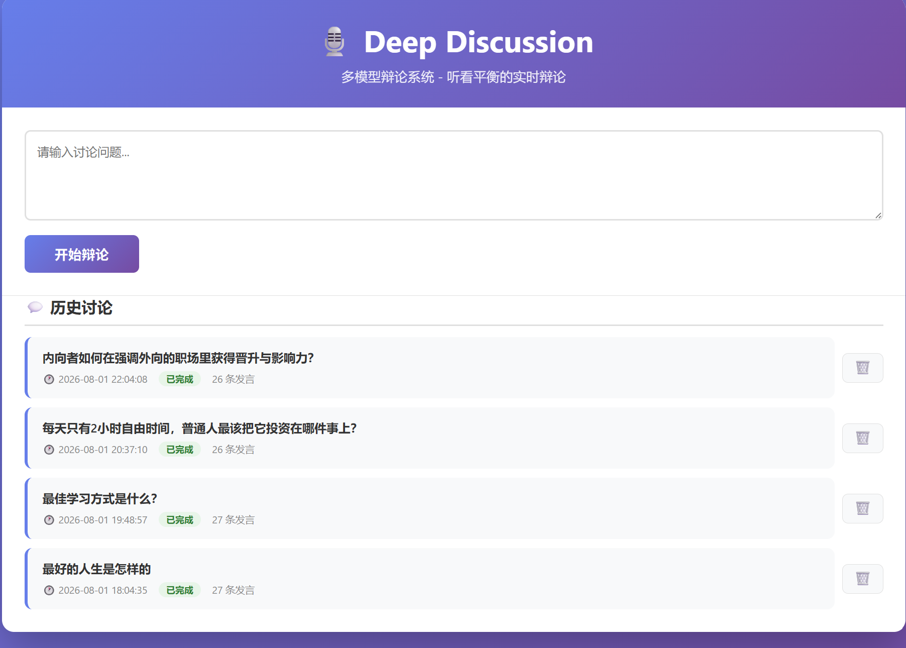
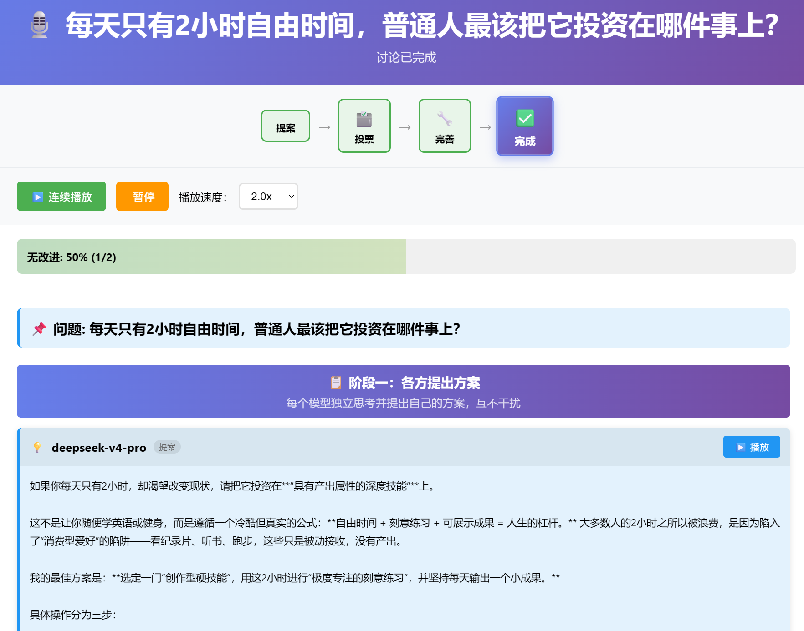
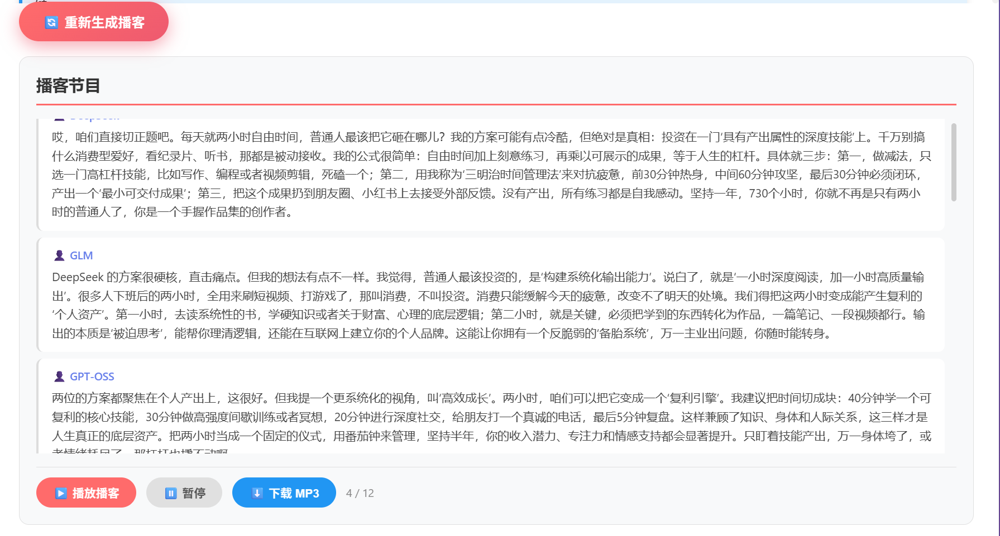

# Deep Discussion：多模型深度讨论

让多个大模型围绕一个复杂问题**民主讨论**——各自提案、投票表决、共同完善——最终收敛出一个融合各方所长的方案，并能一键生成自然对谈的播客。

## 🎧 播客讨论实例：每天只有 2 小时自由时间，普通人最该把它投资在哪件事上

**[▶️ 在线试听](https://cdn.jsdelivr.net/gh/lifeng6666666/deep-discussion@master/podcast_22449ff65bce.mp3)** —— 浏览器原生播放器，可播放/拖动/调速
·
**[⬇️ 下载 MP3](https://github.com/lifeng6666666/deep-discussion/raw/master/podcast_22449ff65bce.mp3)**

## 为什么做这个

实际使用中发现，单个模型回答复杂人生/生活问题时各有偏向：有的偏功利、爱造指标、容易制造焦虑；有的更人文、更体贴。与其只听一家之言，不如让多个模型**彼此吸收长处、彼此批判缺点**，在结构化的讨论中逼近一个更客观、更全面的答案。

Deep Discussion 就是这种思路的落地：不是把模型当搜索框，而是把它们当成一张圆桌上的几位嘉宾。

## 核心特性

- **三阶段民主讨论**：提案 → 投票 → 完善，流程清晰、全程可观测
- **多轮收敛优化**：完善阶段反复评审，所有模型都认为无需改进时自动收敛，最多 n 轮
- **实时观感**：WebSocket 推送，每条发言实时显示，附带流程进度条与收敛度
- **语音播报**：Edge TTS 神经网络语音，每个模型分配不同声色，可单曲/连续播放、调速
- **播客生成**：讨论结束后一键转成无主持人嘉宾对谈脚本，可流畅播放
- **历史管理**：所有讨论持久化保存，可回看、可删除

## 界面预览

**首页 / 历史列表** —— 发起新讨论、回看或删除历史记录



**讨论过程** —— 三阶段实时推进，每条发言、投票结果、收敛度全程可见



**播客播放器** —— 一键把讨论转成嘉宾对谈脚本，逐段播放、可下载 MP3



## 讨论流程

整场讨论分三个阶段，全程实时推送到网页：

### 阶段一：提案

每个模型独立提出一份方案

### 阶段二：投票

每个模型阅读所有提案后，投票选出最佳方案，并说明选择理由与对其他方案的看法。得票最多者成为本轮"获胜方案"。

### 阶段三：完善

围绕获胜方案进行多轮（默认最多 3 轮）共同优化：

1. **评审**：每个非获胜模型判断方案是否存在大的补充或改进之处（回答"改进: 有/无"并说明理由）
2. **收敛判定**：当所有非获胜模型都认为无需改进时，提前收敛结束
3. **整合优化**：仍有改进建议时，获胜模型综合各方反馈，产出优化后的方案，进入下一轮
4. 达到最大轮数仍无共识则强制结束，输出当前最优方案

最终方案以高亮卡片呈现，并解锁播客生成。

## 技术架构

| 层      | 技术                                                 |
| ------ | -------------------------------------------------- |
| Web 框架 | Flask + Flask-SocketIO（WebSocket 实时通信，按讨论 room 隔离） |
| 模型调用   | NVIDIA NIM API（`integrate.api.nvidia.com`）         |
| 语音合成   | edge-tts（微软神经网络 TTS，本地缓存 mp3）                      |
| 配置管理   | python-dotenv（API key 存 `.env`）                    |
| 持久化    | 每个讨论一个 JSON 文件，存于 `discussions/`                   |
| 前端     | 原生 HTML/CSS/JS + Socket.IO 客户端                     |

### 默认参与模型（可自己配置）

| 模型                            | 简称       | TTS 声色 |
| ----------------------------- | -------- | ------ |
| `deepseek-ai/deepseek-v4-pro` | DeepSeek | 男声·沉稳  |
| `z-ai/glm-5.2`                | GLM      | 女声·活泼  |
| `openai/gpt-oss-120b`         | GPT-OSS  | 男声·有力  |

## 快速开始

### 1. 安装依赖

```bash
pip install -r requirements.txt
```

依赖：Flask、Flask-SocketIO、edge-tts、requests、python-dotenv

### 2. 配置 API Key

使用前在 `.env` 文件，填入你的 NVIDIA NIM API key：

```
NVIDIA_API_KEY=nvapi-你的真实key
```

Key 获取地址：<https://build.nvidia.com/>

### 3. 启动

```bash
python app.py
```

浏览器打开 <http://127.0.0.1:5000> 即可。

## 使用方法

1. **发起讨论**：首页输入框写下问题（支持 `Ctrl+Enter` 提交），点"开始辩论"
2. **观看讨论**：跳转到讨论页，实时看到三阶段流程、每条发言、投票结果与收敛度
3. **收听语音**：每条发言带"▶️ 播放"按钮；也可"▶️ 连续播放"整场，支持暂停和 1.0x–2.0x 调速
4. **生成播客**：讨论完成后点"制作播客"，把整场讨论转成嘉宾对谈脚本并逐段播放
5. **历史回看**：首页列出所有历史讨论，可点进去回看完整过程与播客，也可🗑️删除

## 文件结构

```
deep-discussion/
├── app.py                  # Flask 应用：路由、WebSocket 处理、TTS 接口
├── deep_discussion.py      # 核心：三阶段讨论逻辑、提示词、播客生成
├── discussion_store.py     # 讨论记录持久化（JSON 文件）
├── requirements.txt        # 依赖
├── .env                    # 真实 API key（使用前配置）
├── .gitignore
├── templates/
│   ├── index.html          # 首页：发起讨论 + 历史列表
│   └── discussion.html     # 讨论页：实时过程 + 播客播放器
├── static/
│   ├── css/style.css
│   ├── js/discussion.js    # 前端：事件渲染、TTS、播客播放
│   └── audio/              # TTS 音频缓存（忽略，不入库）
└── discussions/            # 讨论记录 JSON（忽略，不入库）
```

## 常见问题

**启动失败 / 端口被占用**\
确认 5000 端口未被占用；Windows 上若 `python` 指向应用商店桩程序，改用真实解释器（如 miniconda 的 `python.exe`）运行。

**讨论过程很慢或停滞**\
每轮需依次调用多个模型 API，单次调用约 10–30 秒，完整讨论通常 5–15 分钟。控制台会打印每次请求的状态（`📤 正在调用` / `✅ 返回成功` / `❌ 被 API 限流`），据此可判断是 API 限流还是正常等待。

**语音播不了**\
首次播放需生成音频，稍等几秒；推荐 Chrome / Edge 浏览器。

## 注意事项

- 需稳定网络连接访问 NVIDIA NIM API
- 免费模型有速率限制，高频使用可能被限流
- `discussions/` 和 `static/audio/` 为运行时数据，已忽略不入库

## 许可证

MIT License
